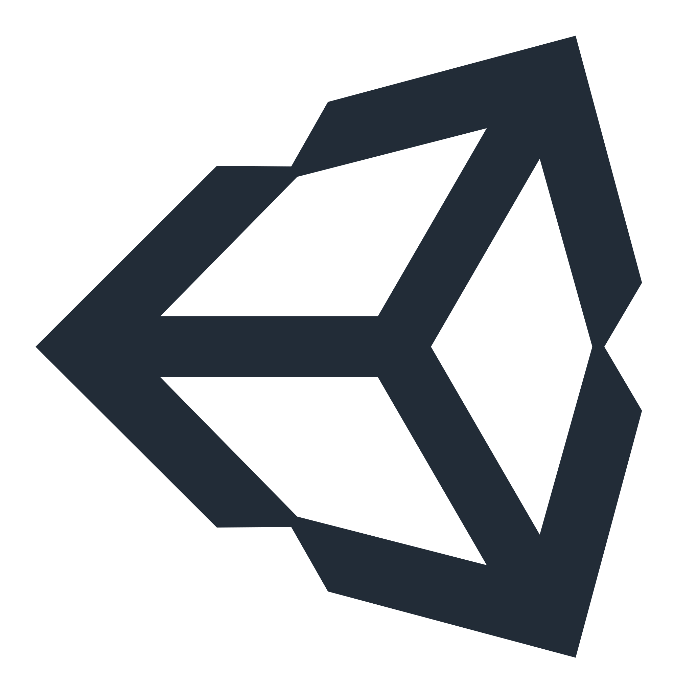
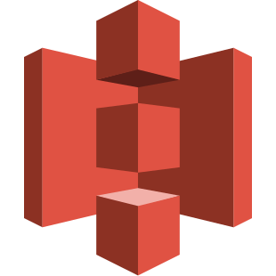

# **Olá! 👋 Eu sou Igor Gurgel :)**
### Hi! 👋🏻 I'm Igor Gurgel :)  

<!-- BIO:START -->
Em primeiro lugar, você pode escolher o idioma Inglês ou Português para ler minha BIO. 
First of all, you can choose de language English or Portuguese to read my BIO.
 

Abra/Feche **English (EN-US)** para ler em **Português (PT-BR)**  
Open/Close **English (EN-U)** to read in **Portuguese (PT-BR)**

 

<small>🔔 English (EN-US)</small>
</a>

## **Come and know a little about me**

- My name is Igor Gurgel
- I live in Natal/RN - Brazil 
- I'm Administrator | Project Manager 
- I'm in transition career to the Tech World
- I speak Portuguese, English and Spanish 
- I'm learning NIHONGO (Japanese) 

## **How to contact me**

 
  
  
  <a href="https://www.linkedin.com/in/igor-barreto-gurgel/" target="_blank">
  
  
  
  
  

 
  
## **Who am I?**
I'm Administrator and Project Manager. I'm a professional with 14 years of experience managing projects. And I discovered that I love math, technology and computers. So I decided to change my career to Product area and development.

Now, let'me show you what I'm studying about management:
  - Lean Six Sigma (OKR, Scrum and Kanban)
  - Quality management
  - Project management
  - Product management
 
And, what I'm studying about development technologies:
  - Algorithm an logic
  - Programming language
  - A lot of tools
  

<!-- BIO:END -->

 

<!-- BIO:START -->

<small>🔔 Português (PT-BR)</small>

## **Conheça um pouco sobre mim**

- Me chamo Igor Gurgel
- Moro em Natal/RN - Brazil 
- Sou Administrador e Gerente de Projetos
- Estou em transição de carreira para o mundo Tech 
- Eu falo Português, Inglês e Espanhol
- Estou aprendendo NIHONGO (Japonês) 

## **Como contatar-me**

 
  
  
  <a href="https://www.linkedin.com/in/igor-barreto-gurgel/" target="_blank">
  
  
  
  
  

 
  
## **Quem sou eu?**
Eu sou Administrador e Gerente de Projetos. Sou um profissional com 14 anos de experiência em gerenciamento de projetos, e descobri que eu amo matemática, tecnologia e computadores. Então, decidi migrar minha carreira para a área de Produto e desenvolvimento.

Agora, deixe-me mostrar o que estou estudando sobre gestão:
  - Lean Six Sigma (OKR, Scrum and Kanban)
  - Gestão de Qualidade
  - Gestão de Projetos
  - Gestão de Produto

E, o que estou estudando sobre tecnologias de desenvolvimento:
  - Algoritmo e lógica
  - Linguagem de programação
  - Muitas ferramentas

<!-- BIO:END -->

 

<!-- STATS:START -->

    
    
    

<!-- STATS:END -->

<!-- SKILLSET:START -->

### Technologies & tools

All these technologies, programming languages and tools I'm still learning.

<table>

<tr>
<td align="center" width="50%" valign="top">

### Frontend

### Want to learn

</td>
<td align="center" valign="top">

### Backend

### Want to learn

</td>
</tr>

<tr>
<td align="center" valign="top">

### Database

### Want to learn

</td>
<td align="center" valign="top">

### Games

I don't know any.

### Want to learn

 

</td>
</tr>

<tr>
<td align="center" valign="top">

### Mobile

I don't know any.

### Want to learn

</td>
<td align="center" valign="top">

### Cloud & DevOps

### Want to learn

</td>
</tr>

<tr>
<td align="center" valign="top">

### Hardware

### Want to learn

</td>
<td align="center" valign="top">

### AI

### Want to learn

</td>
</tr>

<tr>
<td align="center" valign="top">

### Tools & IDEs

### Want to learn

</td>
<td align="center" valign="top">

### Started with

</td>
</tr>

</table>

 

<!-- VIEW-COUNT:START -->

    

<!-- VIEW-COUNT:END -->
